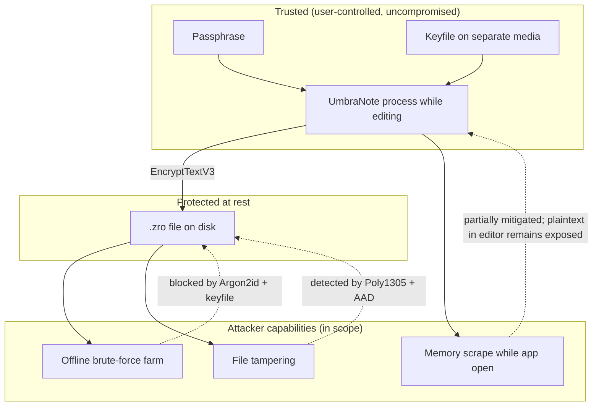
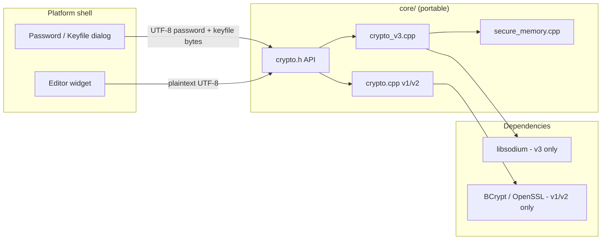
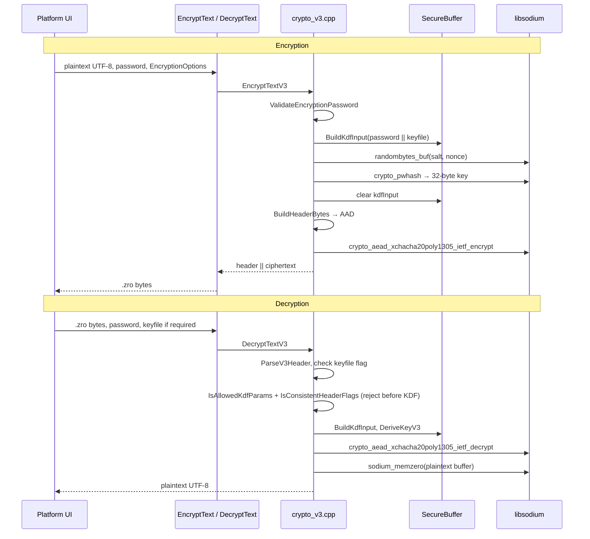

# UmbraNote ZNENC3 Encryption Design

| Field | Value |
|-------|-------|
| **Author** | Systems Architecture (Draft) |
| **Date** | 2026-07-04 |
| **Status** | Draft |
| **Scope** | `.zro` encrypted note format v3 (`ZNENC3`) for UmbraNote `core/` + platform UX |
| **Codebase** | `C:\Users\User\Desktop\UmbraNote` |

---

## Overview

UmbraNote is a cross-platform native text editor (Win32 + GTK4) with a portable `core/` library. Encrypted notes use the `.zro` extension. Versions v1 (`ZNENC1`) and v2 (`ZNENC2`) rely on PBKDF2-SHA256 + AES-256-GCM via platform crypto (BCrypt on Windows, OpenSSL on Linux). **v3 (`ZNENC3`)** is the target high-security format: **Argon2id** key derivation and **XChaCha20-Poly1305** AEAD via **libsodium**, with optional **password + keyfile** two-factor secrets, header authenticated as AAD, and sensitive material held in locked/zeroed `SecureBuffer` regions.

This document specifies the complete v3 cryptographic design, file format, KDF parameters, key-management UX, memory hygiene, legacy migration, threat-model boundaries, and an incremental implementation plan. It is written against the **in-progress** implementation in `core/crypto_v3.cpp`, `core/crypto.cpp`, `core/secure_memory.cpp`, and the Win32 password dialog in `platform/win32/notepad.cpp`.

---

## Background & Motivation

### Current state

| Component | Location | Role |
|-----------|----------|------|
| v3 crypto | `core/crypto_v3.cpp` | Argon2id + XChaCha20-Poly1305 encrypt/decrypt |
| Legacy crypto | `core/crypto.cpp` | v1/v2 PBKDF2 + AES-GCM; dispatches v3 |
| Public API | `core/include/zeronote/crypto.h` | `EncryptText`, `DecryptText`, `EncryptionOptions` |
| Secure memory | `core/secure_memory.cpp` | `SecureBuffer`, `VirtualLock`/`mlock`, `SecureClear` |
| Win32 UX | `platform/win32/notepad.cpp` | Password/keyfile dialog, re-auth on save |
| Linux UX | `platform/linux/main.cpp` | **No encryption UI**; encrypted open returns early |
| Docs | `docs/SECURITY.md`, `docs/FILE_FORMATS.md` | Threat model and on-disk layout |
| Build | `core/CMakeLists.txt` | libsodium via pkg-config (Linux) or FetchContent (Windows) |

**Platform crypto split:** All **new** `.zro` writes use **libsodium on both Windows and Linux**. BCrypt (Windows) and OpenSSL (Linux) are **legacy decrypt-only** for v1/v2. `README.md` still says “Windows uses BCrypt for cryptography” without this v3 caveat — correct in PR 9.

### Pain points motivating v3

1. **PBKDF2 is GPU-friendly.** v2 uses 600k PBKDF2 iterations (`kPbkdf2IterationsV2` in `crypto.cpp`). A stolen `.zro` file can be attacked on commodity GPUs with high parallelism and low memory cost. Nation-state or well-resourced attackers can scale this further (ASIC farms, cloud GPU bursts).

2. **AES-GCM nonce discipline.** v2 uses 96-bit random IVs per file. While collision risk is low at UmbraNote scale, XChaCha20’s 192-bit nonce removes nonce-reuse concerns entirely and simplifies safe random nonce generation.

3. **Single-factor secrets.** v2 is password-only. A passphrase can be guessed offline if the file is stolen. v3’s keyfile requirement (in paranoid mode) forces attackers to obtain **two independent secrets** stored in different locations.

4. **Header tampering.** v1 has no AAD. v2 authenticates a partial header. v3 authenticates the **entire fixed header** as AAD, preventing downgrade of KDF parameters or flag manipulation without detection.

5. **Supply-chain pinning.** v3 depends on libsodium. Windows builds fetch `robinlinden/libsodium-cmake` via CMake `FetchContent`. An earlier invalid `GIT_TAG` (`2257eb3f…`) blocked Windows builds; this is **resolved** — `core/CMakeLists.txt` now pins `GIT_TAG 9b2848dfc1b917a9410f0de9d81059b26cbfaa8d`, FetchContent succeeds, and `UmbraNote.exe` builds. Remaining work: document minimum libsodium version (≥1.0.18), add CI validation on a **clean** Windows runner without a preinstalled libsodium, and record supply-chain review notes in `README.md`.

---

## Goals & Non-Goals

### Goals

| ID | Goal |
|----|------|
| G1 | Make offline brute-force of stolen `.zro` files **memory-hard and slow** (Argon2id SENSITIVE by default). |
| G2 | Require **password + keyfile** for new high-security saves (paranoid mode). |
| G3 | Provide **authenticated encryption** with header integrity (XChaCha20-Poly1305 + AAD). |
| G4 | **Read** legacy v1/v2 files; **write** v3 by default via `EncryptText()`. |
| G5 | Minimize **forensic exposure** of derived keys and KDF inputs via `SecureBuffer` + explicit zeroing. |
| G6 | **Re-authenticate on every save** of an encrypted note (no session password cache on Windows). |
| G7 | Cross-platform `core/` API; platform shells handle UTF-8 ↔ UI encoding only. |
| G8 | **Validate KDF header params** against an allowlist before `crypto_pwhash()` on decrypt (mitigate pre-MAC DoS). |

### Non-Goals

| ID | Non-Goal |
|----|----------|
| NG1 | Defending against **live malware**, keyloggers, clipboard sniffers, or screen capture on a compromised host. |
| NG2 | **Rubber-hose** / coercion resistance. |
| NG3 | **Side-channel** resistance (cache timing, power analysis on crypto primitives). |
| NG4 | **Network** transport security (files are local). |
| NG5 | **Plausible deniability** or hidden volumes. |
| NG6 | **Hardware security modules** (TPM, smart cards) in v3.0. |
| NG7 | Replacing legacy decrypt path with libsodium (v1/v2 stay on BCrypt/OpenSSL). |

---

## Threat Model

### Assumptions

- Attacker obtains a copy of one or more `.zro` files (laptop theft, cloud backup leak, forensic disk image).
- Attacker has **offline** compute (GPUs, ASICs, or cloud) but **not** the user’s keyfile (if used) or passphrase.
- While the app is open, attacker may attempt **memory scraping** (cold boot, crash dumps, `/proc/mem`, hibernation file).
- User’s machine is **not** persistently compromised during normal use (out of scope if it is).

### In-scope threats and mitigations

| Threat | Severity | Mitigation |
|--------|----------|------------|
| Offline passphrase guessing | **Critical** | Argon2id SENSITIVE (~1 GiB RAM, ~3.5 s per guess on Core i7 2.8 GHz); 20+ char password policy; keyfile (≥32 B) in paranoid mode |
| GPU/ASIC parallel KDF | **Critical** | Memory-hard Argon2id; MEMLIMIT_SENSITIVE = 1024 MiB per derivation |
| Ciphertext tampering | **High** | Poly1305 MAC; header as AAD |
| KDF parameter downgrade | **High** | opslimit/memlimit/flags in AAD; verification fails if header modified |
| **KDF parameter DoS (pre-MAC)** | **High** | Attacker crafts header with extreme `opslimit`/`memlimit`; current code calls `crypto_pwhash()` **before** AEAD verify (`DecryptTextV3` lines 210–236 precede decrypt at 245–263). **Mitigation (required):** allowlist valid param pairs **before** `DeriveKeyV3()` |
| Nonce reuse | **Medium** | 192-bit random nonce per file (`randombytes_buf`) |
| Key material in swap | **Medium** | `VirtualLock`/`mlock` on `SecureBuffer` (best-effort; OS may still page under pressure) |
| Session password caching | **Medium** | Win32: no stored password; re-prompt on save. Linux: remove legacy `sessionPassword` when porting UI |
| Weak passwords | **High** | `ValidateEncryptionPassword()` enforces length + character classes |

### Explicitly out of scope

- OS-level keyloggers reading the password dialog.
- Attacker with **both** passphrase and keyfile (game over for ciphertext confidentiality).
- Attacker with **live access** to an unlocked editor (plaintext in `EDIT` / `GtkTextView` buffers).

### Security boundary diagram



---

## Proposed Design

### Architecture



All new `.zro` writes route through **libsodium on both platforms**; BCrypt/OpenSSL are legacy decrypt-only dependencies.

### Cryptographic primitive selection

| Layer | Choice | Rationale |
|-------|--------|-----------|
| KDF | **Argon2id** (`crypto_pwhash_ALG_ARGON2ID13`) | PHC winner; hybrid side-channel + GPU resistance; libsodium-maintained |
| AEAD | **XChaCha20-Poly1305** (`crypto_aead_xchacha20poly1305_ietf`) | 256-bit key; 192-bit nonce; no GCM nonce-length ambiguity |
| RNG | `randombytes_buf` (libsodium) | OS CSPRNG wrapper; requires `sodium_init()` |
| Legacy KDF | PBKDF2-SHA256 | Preserved for backward compatibility only |
| Legacy AEAD | AES-256-GCM | Platform-native; unchanged |

**Why not stay on v2?** PBKDF2 with 600k iterations costs ~milliseconds per guess on a GPU with minimal memory. Argon2id at SENSITIVE costs ~3.5 s and **1 GiB RAM per guess** on a modern CPU ([libsodium docs](https://doc.libsodium.org/password_hashing/default_phf)), shrinking effective attacker parallelism by memory bandwidth.

**Why not AES-GCM for v3?** AES-GCM is fine with unique IVs, but UmbraNote standardizes v3 on libsodium’s IETF XChaCha20-Poly1305 construction for a single cross-platform dependency and safer nonce headroom.

### KDF input composition

Secrets are combined by **concatenation** (not XOR, not HMAC):

```cpp
// core/crypto_v3.cpp — BuildKdfInput()
kdf_input = UTF8(password) || keyfile_bytes
```

| Mode | `kdf_input` | Header `kFlagUsesKeyfile` | Keyfile min size |
|------|-------------|---------------------------|------------------|
| Paranoid (default new save) | `password \|\| keyfile` | `1` (required) | **≥32 B** (UI + core) |
| Standard (non-paranoid) | `password` only, or `password \|\| keyfile` if supplied | `0` or `1` | **≥32 B whenever flag set** (core enforcement required) |

**Keyfile size policy:** Win32 `LoadKeyfileBytes()` rejects `<32` bytes. `EncryptTextV3()` today only checks `keyfile.empty()` for paranoid mode — a 1-byte keyfile is accepted in standard mode if the user supplies one. **Design requirement:** enforce `keyfile.size() >= 32` in core whenever `kFlagUsesKeyfile` is set (encrypt and decrypt), matching UI and closing the standard-mode loophole.

See **KD11** for the concatenation composition decision.

### KDF parameters

Stored **per file** in the header (little-endian `uint32` opslimit, `size_t`-compatible memlimit). Verified via AAD on decrypt.

| Profile | libsodium constants | RAM | Approx. time (Core i7 2.8 GHz) | Use case |
|---------|---------------------|-----|--------------------------------|----------|
| **Paranoid** | `OPSLIMIT_SENSITIVE` + `MEMLIMIT_SENSITIVE` | **1024 MiB** | **~3.5 s** | Default for new encrypted saves (`paranoid_kdf = true`) |
| **Standard** | `OPSLIMIT_MODERATE` + `MEMLIMIT_MODERATE` | **256 MiB** | **~0.7 s** | Optional; user unchecks “High-security mode” in save dialog |

Implementation (`GetKdfLimits()` in `crypto_v3.cpp`):

```cpp
if (paranoid) {
    opslimit = crypto_pwhash_OPSLIMIT_SENSITIVE;
    memlimit = crypto_pwhash_MEMLIMIT_SENSITIVE;
} else {
    opslimit = crypto_pwhash_OPSLIMIT_MODERATE;
    memlimit = crypto_pwhash_MEMLIMIT_MODERATE;
}
```

#### KDF parameter allowlist (decrypt path — required)

Before `DeriveKeyV3()` on decrypt, validate header KDF fields against an **exact allowlist** of the two profiles UmbraNote writes. Validation runs in two steps — both must pass **before** `crypto_pwhash()`:

```cpp
bool IsAllowedKdfParams(std::uint32_t ops, std::uint32_t mem) {
    return (ops == crypto_pwhash_OPSLIMIT_SENSITIVE &&
            mem == crypto_pwhash_MEMLIMIT_SENSITIVE) ||
           (ops == crypto_pwhash_OPSLIMIT_MODERATE &&
            mem == crypto_pwhash_MEMLIMIT_MODERATE);
}

bool IsConsistentHeaderFlags(std::uint8_t flags,
                             std::uint32_t ops, std::uint32_t mem) {
    const bool paranoid = (flags & kFlagParanoidKdf) != 0;
    const bool sensitive = (ops == crypto_pwhash_OPSLIMIT_SENSITIVE &&
                            mem == crypto_pwhash_MEMLIMIT_SENSITIVE);
    const bool moderate = (ops == crypto_pwhash_OPSLIMIT_MODERATE &&
                           mem == crypto_pwhash_MEMLIMIT_MODERATE);
    return (paranoid && sensitive) || (!paranoid && moderate);
}
```

`kFlagParanoidKdf` (bit1) must agree with the stored param pair: **paranoid ⟺ SENSITIVE**, **¬paranoid ⟺ MODERATE**. Without this check, a header with `kFlagParanoidKdf=1` and MODERATE params (or flag clear + SENSITIVE params) passes the ops/mem allowlist, decrypts successfully, and misleads UI via `GetEncryptedFileInfoV3()` which reads `paranoid_kdf` from the flag — not the param pair.

Reject failed validation with a **generic** file error (`"Cannot open encrypted file."`) **without** calling `crypto_pwhash()`. This closes the pre-MAC DoS where a malicious `.zro` forces multi-gigabyte allocations or multi-minute CPU work on every unlock attempt, even with a wrong password.

On encrypt, UmbraNote only writes consistent flag/param pairs via `GetKdfLimits()`; AAD still detects post-encryption tampering.

**Pinned numeric assumption:** The allowlist compares on-disk values to **compile-time** `crypto_pwhash_*` macros from the linked libsodium. With the pinned FetchContent ref (`9b2848df…`), verified Argon2id presets are:

| Profile | `opslimit` | `memlimit` |
|---------|------------|------------|
| SENSITIVE | `4` | `1073741824` (1 GiB) |
| MODERATE | `3` | `268435456` (256 MiB) |

UmbraNote v3.0 accepts **exactly these two pairs** as written today. If a future libsodium release changes preset constants, older `.zro` files with previous numeric values could fail the allowlist despite being legitimate — see **OQ7**. PR 2 fixture blobs must embed these ops/mem values to lock the contract.

**Quantified brute-force cost (defender-oriented lower bound):**

- Paranoid: ~3.5 s × 1 GiB ≈ **24,000 guesses/day/GPU-equivalent** — a **defender-oriented lower bound** assuming memory bandwidth caps parallelism at CPU-like levels. Attacker throughput varies with VRAM-per-lane on GPU Argon2 implementations and with dedicated Argon2 ASIC/cloud bursts; do not treat this figure as a hard ceiling on nation-state capability. It still justifies Argon2id over PBKDF2.
- v2 PBKDF2 600k: **millions of guesses/day/GPU** (memory-independent).

**Operational constraint:** Paranoid unlock on a 4 GiB RAM VM may fail if `crypto_pwhash` cannot allocate 1 GiB (`returns -1`). **Not implemented today** — `DeriveKeyV3()` maps any non-zero return to `"Failed to derive encryption/decryption key."` Target: distinct `kdf_oom` error via `CryptoErrorCode` (see **PR 5**).

### File format: ZNENC3

#### Byte layout

| Offset | Size | Field | Description |
|--------|------|-------|-------------|
| 0 | 6 | Magic | ASCII `ZNENC3` |
| 6 | 1 | Version | `0x03` |
| 7 | 1 | Flags | bit0=`kFlagUsesKeyfile` (0x01), bit1=`kFlagParanoidKdf` (0x02) |
| 8 | 1 | KDF ID | `0x01` = Argon2id |
| 9 | 4 | Ops limit | LE `uint32`; libsodium `opslimit` |
| 13 | 4 | Mem limit | LE `uint32`; libsodium `memlimit` |
| 17 | 32 | Salt | CSPRNG (`randombytes_buf`) |
| 49 | 24 | Nonce | CSPRNG; XChaCha20 public nonce |
| 73 | variable | Ciphertext | `crypto_aead_xchacha20poly1305_ietf` output (plaintext + 16-byte Poly1305 tag) |

**Fixed header size:** `kHeaderSizeV3` = **73 bytes** (computed in `crypto_v3.cpp`).

#### AAD scope

The **entire 73-byte header** is passed as AAD to `crypto_aead_xchacha20poly1305_ietf_encrypt/decrypt`. Tampering with salt, nonce, or ciphertext causes MAC verification failure. After allowlist validation, wrong password/keyfile and MAC failure map to a **single auth-failure string** (see Error taxonomy below).

#### Storage estimates

| Note size | Approx. file size |
|-----------|-------------------|
| 1 KiB UTF-8 | 73 + 1024 + 16 ≈ **1.1 KiB** |
| 64 KiB | ≈ **64.1 KiB** |
| 1 MiB | ≈ **1.00 MiB** |

No padding or compression in v3.0; ciphertext length reveals plaintext length within 16 bytes.

#### On-disk example (hex sketch)

```
5A4E454E4333 03 03 01 [ops:4] [mem:4] [salt:32] [nonce:24] [ciphertext+tag]
ZNENC3        ver flags KDF
```

### Encrypt/decrypt flow



### Core API (current and proposed)

#### `core/include/zeronote/crypto.h` (existing)

```cpp
struct EncryptionOptions {
    std::vector<std::uint8_t> keyfile;
    bool paranoid_kdf = true;
};

struct EncryptedFileInfo {
    int version = 0;
    bool requires_keyfile = false;
    bool paranoid_kdf = false;
};

bool EncryptText(const std::string& plaintextUtf8, const std::string& passwordUtf8,
                 std::vector<std::uint8_t>& output, std::string& error,
                 const EncryptionOptions& options = {});

bool DecryptText(const std::vector<std::uint8_t>& data, const std::string& passwordUtf8,
                 std::string& plaintextUtf8, std::string& error,
                 const EncryptionOptions& options = {});
```

`EncryptText()` delegates exclusively to `EncryptTextV3()` (`crypto.cpp` line 427). **Legacy v1/v2 encrypt helpers are not exposed** — they were removed from the public entry point. Only `DecryptText()` retains v1/v2 read paths.

#### Proposed additions

**v3.0 (PR 5 + PR 6):**

```cpp
enum class CryptoErrorCode {
    ok = 0,
    corrupt_file,      // unparseable header / disallowed KDF params
    missing_keyfile,   // kFlagUsesKeyfile but empty keyfile input
    kdf_oom,           // crypto_pwhash returned -1
    auth_failure,      // wrong password/keyfile or MAC failure (uniform UI string)
    internal_error     // sodium_init, unexpected KDF error
};

// PR 5 — advisory progress hook; KDF remains synchronous on calling thread
using KdfProgressFn = void(*)(void* ctx);

struct EncryptionOptions {
    std::vector<std::uint8_t> keyfile;
    bool paranoid_kdf = true;
    KdfProgressFn kdf_progress = nullptr;  // optional; spinner/wait-cursor only
    void* kdf_progress_ctx = nullptr;
};

// Optional out-parameter on EncryptText / DecryptText for platform UI branching
bool DecryptText(..., CryptoErrorCode* error_code = nullptr);

// v3.0 — PR 6
bool GenerateKeyfile(std::vector<std::uint8_t>& out, std::size_t bytes = 64,
                     std::string& error);
```

**KDF progress semantics (PR 5):** `crypto_pwhash()` blocks the calling thread (today: UI thread). The callback is **advisory only** — invoked periodically if libsodium exposes a hook, or once at KDF start/end otherwise. It exists so Win32 can set a wait cursor or show a modal spinner. **Cancellation is unsafe** (partial KDF state); v3.0 does not expose cancel.

**v3.1 (deferred):**

```cpp
// Batch upgrade helper — NOT in v3.0 scope; PR 7 uses manual Save Encrypted As
bool UpgradeEncryptedFile(const std::vector<std::uint8_t>& legacy,
                          const std::string& passwordUtf8,
                          std::vector<std::uint8_t>& v3_out,
                          std::string& error,
                          const EncryptionOptions& new_options);
```

---

## Key Management UX

### Windows (implemented)

| Action | Behavior | Code path |
|--------|----------|-----------|
| **Save Encrypted As** | `IDD_PASSWORD` dialog; paranoid checked by default; requires keyfile if paranoid | `DoFileSaveEncryptedAs()` |
| **Open encrypted** | Prompt password + keyfile if `requires_keyfile`; paranoid checkbox disabled (read from file) | `DoFileOpen()` |
| **Save existing encrypted** | Re-prompt password (**no session cache**) | `DoFileSave()` when `fileEncrypted` |
| **Keyfile browse** | Any file ≥32 bytes | `LoadKeyfileBytes()` |
| **New plain save** | Clears encryption session | `ClearEncryptionSession()` |

**Password policy** (`ValidateEncryptionPassword()`):

| Mode | Min length | Character classes |
|------|------------|-------------------|
| Paranoid | 20 | ≥3 of {lower, upper, digit, symbol} |
| Standard | 12 | ≥2 classes |

**Gaps to close:**

1. **No keyfile generator** — user must supply arbitrary file; PR 6 adds “Generate keyfile…” via core `GenerateKeyfile()` (64 CSPRNG bytes).
2. **Password stored in `std::wstring`** in `PasswordDialogParams` — not locked; zero after use (see Memory Hygiene).
3. **Password confirmation** (`IDC_PASSWORD_CONFIRM`, `PasswordDlgProc` lines 888–889) — also held in dialog controls and `std::wstring` temporaries; must be zeroed alongside primary password.
4. **Keyfile in `std::vector<uint8_t>`** — not locked; copy into `SecureBuffer` before KDF.
5. **No keyfile path hint** — UX should instruct separate storage (USB, password manager attachment).
6. **`GetEncryptedFileInfo()` legacy bug** — for v1/v2, `info.paranoid_kdf = header.version >= 2` (`crypto.cpp` line 378) is wrong; v2 has no paranoid KDF. Fix: `paranoid_kdf = false` for v1/v2. Legacy open UX: paranoid checkbox disabled, KDF profile N/A.

### Linux (not implemented)

`platform/linux/main.cpp` aborts open when `IsEncryptedFile()` returns true. Roadmap item per `README.md`. Port should:

- Reuse `zeronote::crypto` API identically.
- Mirror Win32 policy: **no `sessionPassword` persistence** (remove dead field at lines 19–20, 55–58).
- GTK dialog equivalent to `IDD_PASSWORD` with paranoid toggle and keyfile chooser.

### Recommended user workflow (document in UI strings)

1. **Create** keyfile: 64-byte random file, stored on separate device.
2. **Choose** 20+ character passphrase (diceware or password manager).
3. **Save Encrypted As** with both; verify open works.
4. **Rotate** by Save Encrypted As with new password + new keyfile; securely delete old keyfile.
5. **Close** app when stepping away (plaintext in editor).

---

## Memory Hygiene

### Current implementation

| Asset | Container | Locked? | Zeroed on release? |
|-------|-----------|---------|-------------------|
| KDF input | `SecureBuffer` | Yes (`VirtualLock`/`mlock`) | Yes (`SecureClear`) |
| Derived AEAD key | `SecureBuffer` | Yes | Yes |
| Decrypted plaintext temp | `std::vector<uint8_t>` | No | Yes (`sodium_memzero`) |
| Password (UI) | `std::wstring` in `PasswordDialogParams` | No | **No** |
| Password confirm (UI) | `IDC_PASSWORD_CONFIRM` edit + `std::wstring` temp | No | **No** |
| `WideToUtf8` temporaries | `std::string` on stack/heap | No | **No** |
| Keyfile (UI) | `std::vector<uint8_t>` | No | **No** |
| Editor content | Win32 `EDIT` / GTK buffer | No | N/A |

`SecureBuffer` (`secure_memory.cpp`) unlocks and clears on `resize`, `clear`, and destructor. Lock failure is silent (`locked_ = false`); buffer still functions but may swap.

### Hardening recommendations

| Priority | Change | File(s) |
|----------|--------|---------|
| P0 | Zero `PasswordDialogParams::password` after `SaveEncryptedFile` / `DecryptText` | `notepad.cpp` |
| P0 | Zero password **confirmation** (`IDC_PASSWORD_CONFIRM`) and `confirm` `std::wstring` in `PasswordDlgProc` after dialog closes | `notepad.cpp` |
| P0 | Zero `WideToUtf8(password)` / `WideToUtf8(confirm)` temporaries where feasible after crypto call | `notepad.cpp` |
| P1 | Load keyfile into `SecureBuffer` before passing to `EncryptionOptions` | `crypto_v3.cpp`, `crypto.h` |
| P1 | Use `sodium_memzero` on Linux for `SecureClear` when libsodium linked | `secure_memory.cpp` |
| P2 | Optional `SecureWideString` RAII for password dialog | new `secure_memory.h` |
| P2 | Lock minimum working set on Windows (`SetProcessWorkingSetSize`) — marginal gain | platform-specific |

**Threat realism:** Memory scraping while the app is open can still recover **editor plaintext** and likely **dialog passwords**. Hygiene reduces **residual** secrets after operations complete; it does not defeat live compromise.

---

## Legacy Migration

### Format summary

| Format | Magic | KDF | AEAD | Plaintext encoding |
|--------|-------|-----|------|-------------------|
| v1 | `ZNENC1` | PBKDF2 100k, 16 B salt | AES-GCM, no AAD | UTF-16 LE (+ optional BOM) |
| v2 | `ZNENC2` | PBKDF2 600k, 32 B salt | AES-GCM, AAD on partial header | UTF-8 |
| v3 | `ZNENC3` | Argon2id, 32 B salt | XChaCha20-Poly1305, full header AAD | UTF-8 |

### Read path (implemented)

`DecryptText()` in `crypto.cpp`:

1. Detect v3 via `IsEncryptedFileV3()` → `DecryptTextV3()`.
2. Else `ParseHeader()` → PBKDF2 + AES-GCM decrypt.
3. v1: `Utf8FromWideStorage()` conversion.

### `GetEncryptedFileInfo()` legacy bug (to fix)

For v1/v2 files, `GetEncryptedFileInfo()` incorrectly sets `info.paranoid_kdf = (header.version >= 2)`. v2 has no paranoid/profile concept. Win32 seeds the password dialog with `auth.paranoid_kdf = info.paranoid_kdf`, misleading UI state (decrypt still works via legacy path). **Fix:** set `paranoid_kdf = false` for v1/v2; only populate from v3 header flags. Legacy open UX: disable paranoid checkbox; label “KDF: legacy PBKDF2”.

### Upgrade path (manual today)

1. User opens legacy `.zro` with password.
2. **File → Save Encrypted As** → new v3 file with password + keyfile.
3. Securely delete legacy file if desired.

### Proposed automatic upgrade UX (future)

- On open of v1/v2, show banner: “This note uses legacy encryption. Upgrade to ZNENC3?”
- **Upgrade** re-encrypts in place or Save As with new secrets.
- `UpgradeEncryptedFile()` API deferred to **v3.1**; v3.0 uses manual Save Encrypted As (PR 7).

**Migration risks:**

| Risk | Severity | Mitigation |
|------|----------|------------|
| User forgets new keyfile after upgrade | High | Confirm keyfile saved; test reopen |
| Downgrade attack (swap v3 → v2) | Low | v3 magic distinct; user would notice in UI |
| Partial write on in-place upgrade | Medium | Atomic write: temp file + `rename` |

---

## Alternatives Considered

### 1. Retain PBKDF2 + AES-GCM (v2) as default

| Pros | Cons |
|------|------|
| No libsodium dependency; faster unlock | GPU-vulnerable; fails nation-state offline threat model |
| Already shipped | No keyfile story |

**Rejected** for new writes; kept for decrypt-only.

### 2. scrypt instead of Argon2id

| Pros | Cons |
|------|------|
| Memory-hard; well studied | libsodium does not expose scrypt for `crypto_pwhash`; would add OpenSSL scrypt or separate library |

**Rejected** — Argon2id is libsodium’s default PHF and matches SENSITIVE presets.

### 3. Password-only v3 (no keyfile)

| Pros | Cons |
|------|------|
| Simpler UX | Single secret stealable via phishing; weaker against offline attack |

**Partially accepted** as non-paranoid mode (`paranoid_kdf = false`, keyfile optional). **Default remains two-factor** for new saves.

### 4. External format (age, Minisign, GPG)

| Pros | Cons |
|------|------|
| Interoperability | Breaks `.zro` continuity; heavier deps; worse notepad UX |

**Rejected** — UmbraNote owns `.zro` lifecycle.

### 5. HKDF nested: Argon2 → HKDF(salt, context)

| Pros | Cons |
|------|------|
| Domain separation for subkeys | Overkill for single AEAD key; added complexity |

**Deferred** — direct 32-byte `crypto_pwhash` output matches XChaCha20 key size.

---

## Security & Privacy Considerations

### Error message taxonomy

**Current implementation** (`DecryptTextV3`) returns distinguishable strings — KD9 was inaccurate:

| Condition | Current message | Category |
|-----------|-----------------|----------|
| `ParseV3Header` failure | `"Encrypted file is corrupt."` | File format |
| Keyfile required but missing | `"This file requires the original keyfile."` | User input |
| Empty password | `"Password cannot be empty."` | User input |
| Disallowed KDF params / flag-param mismatch (not yet implemented) | — | File format |
| `crypto_pwhash` failure (incl. OOM) | `"Failed to derive decryption key."` | Resource / internal |
| MAC / wrong secrets | `"Incorrect password, keyfile, or corrupted file."` | Auth failure |
| Legacy v2 MAC fail | `"Incorrect password or corrupted file."` | Auth failure (no keyfile mention) |

**Target v3.0 behavior** (**PR 5** + crypto hardening):

| Category | User-facing string | `CryptoErrorCode` | Oracle risk |
|----------|-------------------|-------------------|-------------|
| File format (parse fail, disallowed KDF params) | `"Cannot open encrypted file."` | `corrupt_file` | Low — reveals only “not a valid v3 blob” |
| User input (empty password, missing keyfile when required) | Specific guidance strings | `missing_keyfile` etc. | Acceptable — user-fixable, no MAC leak |
| Resource (KDF OOM) | `"Insufficient memory for key derivation."` | `kdf_oom` | Acceptable — not auth oracle |
| Auth failure (wrong password/keyfile, MAC fail, KDF fail after valid params) | **Single string:** `"Incorrect password, keyfile, or corrupted file."` | `auth_failure` | Minimized |
| Internal (`sodium_init`, unexpected) | `"Failed to initialize cryptographic library."` | `internal_error` | Rare |

**Do not** distinguish MAC failure from wrong-password KDF output in the auth-failure bucket. Legacy v2 should use the same auth-failure string shape for consistency.

### Keyfile handling

- Keyfile contents are **hashed into KDF input**, not stored in the file (only `kFlagUsesKeyfile`).
- Keyfile **fingerprint is not recorded** — user must track which keyfile matches which note.
- **Recommendation:** name keyfiles `note-title.zkf` and store hash in user’s password manager entry.

### Randomness

`sodium_init()` called at start of each `EncryptTextV3`/`DecryptTextV3`. For performance, could move to `core` init once (libsodium docs note speedup). Not security-critical.

### Supply chain

- Pin libsodium via proven `GIT_TAG 9b2848dfc1b917a9410f0de9d81059b26cbfaa8d` (Windows FetchContent) or `libsodium-dev` (Linux CI). Minimum libsodium **1.0.18+** (Argon2id support).
- KDF allowlist numeric pairs are tied to the libsodium version linked at build time; see pinned preset table under KDF parameter allowlist and OQ7.
- CI: clean Windows runner must succeed FetchContent without preinstalled libsodium.

### Privacy

- Ciphertext length leaks plaintext size.
- No metadata encryption (filename, timestamps external to `.zro`).

---

## Observability

UmbraNote is a desktop app; observability targets **support diagnostics**, not centralized telemetry.

| Event | Log level | Notes |
|-------|-----------|-------|
| `sodium_init` failure | Error | Fatal to crypto op |
| `crypto_pwhash` OOM (`-1`) | Error | Distinct `kdf_oom` message via PR 5 (**not implemented**; today lumped into derive failure) |
| Decrypt MAC failure | **No log** | Avoid leaking attempt validity |
| KDF duration | Debug (opt-in) | Local perf tuning only |
| Legacy format detected | Info | Prompt upgrade |

**Metrics (optional dev builds):** histogram of `DeriveKeyV3` latency by ops/mem profile; counter of v1/v2/v3 opens.

**No network reporting** of passwords, keyfiles, or plaintext hashes.

---

## Rollout Plan

### Phase 0: Build verification (complete)

- ✅ `GIT_TAG 9b2848dfc1b917a9410f0de9d81059b26cbfaa8d` in `core/CMakeLists.txt`; Windows FetchContent succeeds; `UmbraNote.exe` builds.
- Remaining: CI clean-runner validation; document pinned ref and minimum libsodium version in `README.md`.

### Phase 1: Core safety (before UX polish)

1. **Test harness bootstrap** — no `tests/` directory exists today; no `enable_testing()` in CMake; CI builds only.
2. **KDF param allowlist** + keyfile min-size enforcement in core.
3. **Atomic `.zro` writes** — crash mid-save causes data loss of the only copy; higher priority than keyfile-generator copy.
4. **Crypto unit tests** including generated v1/v2 fixture blobs.
5. **Memory hygiene** (PR 4) + **`CryptoErrorCode`** / KDF OOM distinction (PR 5).

### Phase 2: Windows polish

- Keyfile generator (`GenerateKeyfile()` in core + Win32 button).
- Upgrade prompt for v1/v2 opens (UI-only; no `UpgradeEncryptedFile()`).
- Progress UI for 3.5 s KDF via `KdfProgressFn` in PR 5 (wait cursor/spinner; **not cancellable**).

### Phase 3: Linux parity

- GTK password/keyfile dialog.
- Encrypted save/open menu items.
- Remove `sessionPassword` dead code.

### Phase 4: Release

- Mark v3 default in `docs/SECURITY.md` and `README.md` (including libsodium-for-v3-on-both-platforms).
- Version bump to 1.3+.
- Changelog: “New encrypted notes use ZNENC3; re-save to upgrade.”

### Rollback strategy

- `DecryptText()` retains v1/v2/v3 read support permanently.
- **Emergency compile flag** `ZERONOTE_ENCRYPT_DEFAULT_V2` (not in tree today):
  - **Location:** `core/crypto.cpp` — `#ifdef` around `EncryptText()` to call a restored v2 encrypt helper.
  - **CMake:** `option(ZERONOTE_ENCRYPT_DEFAULT_V2 "Emergency: write v2 instead of v3" OFF)` in `core/CMakeLists.txt`; default **OFF**.
  - **Governance:** release-branch only; requires explicit security review and maintainer approval; never enabled in CI or public releases without incident declaration.
  - **UX:** if enabled at build time, show warning on first encrypted save: “Using legacy encryption (ZNENC2).”
  - **Scope:** v3.0 doc records the design; implementation deferred unless a v3 AEAD bug is confirmed in production.

### Runtime options (v3.0)

| Option | Default | Purpose | PR |
|--------|---------|---------|-----|
| `paranoid_kdf` in `EncryptionOptions` | `true` | Per-save KDF profile (SENSITIVE vs MODERATE) | shipped |
| `kdf_progress` in `EncryptionOptions` | `nullptr` | Advisory spinner/wait-cursor during KDF | PR 5 |

**Deferred to v3.1 (OQ8):** compile-time `ZERONOTE_REQUIRE_KEYFILE` — would force keyfile for all v3 saves even when user unchecks high-security mode. Not in v3.0 scope; runtime `paranoid_kdf` + `ValidateEncryptionPassword` already enforce two-factor for default saves.

---

## Open Questions

| # | Question | Recommendation |
|---|----------|----------------|
| OQ1 | Should non-paranoid mode remain exposed in UI, or hide behind “Advanced”? | Keep checkbox for power users; default checked |
| OQ2 | Pin exact libsodium version (1.0.19?) or follow distro latest? | Pin minimum 1.0.18+; CI uses distro package hash |
| OQ3 | Atomic save for encrypted files? | **Resolved:** yes — PR 3; `WriteFileBytes()` today is direct `ofstream` with no `fsync` |
| OQ4 | Record keyfile fingerprint (SHA-256) in header for user hints? | **No** — leaks keyfile identity; keep header minimal |
| OQ5 | Argon2 time budget on low-RAM ARM devices? | Detect `crypto_pwhash` failure; offer MODERATE retry |
| OQ6 | Should `EncryptText` validate password on decrypt path? | **No** — only KDF+MAC validates |
| OQ7 | If libsodium changes preset constants, how do we read old `.zro` files? | Widen allowlist to include historical numeric pairs, or bump format version; fixture blobs in PR 2 lock v3.0 contract (`4/1073741824`, `3/268435456`) |
| OQ8 | Implement compile-time `ZERONOTE_REQUIRE_KEYFILE`? | **Deferred v3.1** — see Runtime options; evaluate after v3.0 GA based on user demand for disabling non-paranoid mode |

---

## References

- `C:\Users\User\Desktop\UmbraNote\docs\SECURITY.md`
- `C:\Users\User\Desktop\UmbraNote\docs\FILE_FORMATS.md`
- `C:\Users\User\Desktop\UmbraNote\core\crypto_v3.cpp`
- `C:\Users\User\Desktop\UmbraNote\core\crypto.cpp`
- `C:\Users\User\Desktop\UmbraNote\core\secure_memory.cpp`
- [libsodium password hashing](https://doc.libsodium.org/password_hashing/default_phf)
- [Argon2 specification](https://github.com/P-H-C/phc-winner-argon2/raw/master/argon2-specs.pdf)
- RFC 8439 (ChaCha20-Poly1305), XChaCha20 extended nonce construction (libsodium IETF variant)

---

## Key Decisions

| # | Decision | Rationale |
|---|----------|-----------|
| KD1 | **Argon2id** with libsodium SENSITIVE preset as default | Memory-hard KDF aligned with nation-state offline threat model; ~1 GiB × ~3.5 s per guess |
| KD2 | **XChaCha20-Poly1305** for v3 AEAD | 192-bit nonce safety; single cross-platform crypto library |
| KD3 | **Password + keyfile** required in paranoid mode | Two independent secrets; stolen file alone insufficient if keyfile separated |
| KD4 | **Full 73-byte header as AAD** | Prevents silent downgrade of KDF params or flags |
| KD5 | **libsodium for v3 only**; BCrypt/OpenSSL for legacy | Avoid reimplementing v1/v2; minimize migration risk |
| KD6 | **No session password** on Windows | Re-auth on save limits exposure window |
| KD7 | **`SecureBuffer` for KDF input and derived key** | Best-effort swap suppression + zeroization |
| KD8 | **v3 encrypt-only default** via `EncryptText()` | Legacy read support without perpetuating weak writes |
| KD9 | **Tiered error taxonomy** | User-input and resource errors may be specific; **auth failures use one string**; file-format errors generic. Fixes current oracle where MAC vs parse vs derive are distinguishable |
| KD10 | **KDF params stored per file** | Future-proofs parameter rotation; verified by AAD |
| KD11 | **Concatenation KDF input (`password \|\| keyfile`) for v3.0** | Accepted for v3.0 interoperability; simple, matches shipped code. Length-prefixed `crypto_generichash` deferred — trigger: **format version bump to v4** if changed, since it breaks KDF output for existing files |
| KD12 | **KDF param allowlist + flag/param consistency before `crypto_pwhash` on decrypt** | Closes pre-MAC DoS; ensures `kFlagParanoidKdf` matches SENSITIVE/MODERATE pair; AAD alone is insufficient because KDF runs first |

---

## PR Plan

| PR | Title |
|----|-------|
| 1 | Pin and verify libsodium supply chain |
| 2 | Test harness bootstrap + crypto tests |
| 3 | Atomic encrypted file writes |
| 4 | Secure memory and dialog secret hygiene |
| 5 | Crypto error codes, KDF OOM, and progress UX |
| 6 | Core `GenerateKeyfile()` + Win32 generator UI |
| 7 | Legacy upgrade prompt on open (UI-only) |
| 8 | Linux GTK encryption dialogs |
| 9 | Documentation and release alignment |

### PR 1: Pin and verify libsodium supply chain

**Title:** `build: pin proven libsodium-cmake ref and validate CI FetchContent`

**Files/components:**
- `core/CMakeLists.txt` (document `GIT_TAG 9b2848dfc1b917a9410f0de9d81059b26cbfaa8d`)
- `.github/workflows/ci.yml` (clean Windows runner, no preinstalled libsodium)
- `README.md` (minimum libsodium 1.0.18+, supply-chain note)

**Dependencies:** None

**Description:** Build gate is **already passed** locally. This PR documents the proven ref, adds CI validation on a clean Windows runner, and records minimum libsodium version. Not a “fix broken ref” PR — verification and pinning only.

---

### PR 2: Test harness bootstrap + crypto tests

**Title:** `test: bootstrap Catch2 harness and ZNENC3/legacy crypto tests`

**Files/components:**
- New `tests/CMakeLists.txt`, `tests/crypto_v3_test.cpp`, `tests/fixtures/` (hex blobs)
- Root `CMakeLists.txt` — `enable_testing()`, `add_subdirectory(tests)`
- `.github/workflows/ci.yml` — `ctest` step
- `core/crypto_v3.cpp` — `IsAllowedKdfParams()`, `IsConsistentHeaderFlags()`, keyfile min-size enforcement
- `core/crypto.cpp` — fix `GetEncryptedFileInfo()` legacy `paranoid_kdf` bug

**Dependencies:** PR 1

**Description:** Repo has **no** test infrastructure today. This PR:
1. Selects **Catch2** (header-only, low CMake friction) via `FetchContent`.
2. Wires `enable_testing()` / `add_test()`.
3. **Generates** v1/v2 golden fixture files (known password → commit hex blobs).
4. Tests: v3 round-trip; tampered MAC/header rejection; **rejected out-of-range KDF params** (no `crypto_pwhash` call); **mismatched `kFlagParanoidKdf`/param pair** rejected; keyfile `<32` B rejected when flag set; legacy decrypt; `GetEncryptedFileInfo` v2 returns `paranoid_kdf=false`.
5. Fixture blobs embed pinned ops/mem values (`4/1073741824`, `3/268435456`) to lock allowlist contract.

---

### PR 3: Atomic encrypted file writes

**Title:** `io: atomic write for .zro encrypted saves`

**Files/components:**
- `core/text_codec.cpp` — new `WriteFileBytesAtomic()` (or extend `WriteFileBytes`)
- `platform/win32/notepad.cpp` (`SaveEncryptedFile`)
- `platform/linux/main.cpp` (when encryption lands)

**Dependencies:** None

**Description:** `WriteFileBytes()` today uses direct `ofstream` write with no `fsync`. Write to `path.zro.tmp`, flush + `fsync`, then:
- **Windows:** `MoveFileEx(..., MOVEFILE_REPLACE_EXISTING)` or `ReplaceFile`
- **Linux:** `rename(2)` (atomic on same filesystem)

Prevents truncated `.zro` on crash — **Phase 1 priority** before UX polish.

---

### PR 4: Secure memory and dialog secret hygiene

**Title:** `crypto: harden secret buffer handling for passwords and keyfiles`

**Files/components:**
- `core/include/zeronote/secure_memory.h`, `core/secure_memory.cpp`
- `core/crypto_v3.cpp`, `core/include/zeronote/crypto.h`
- `platform/win32/notepad.cpp` — zero `password`, `confirm` (`IDC_PASSWORD_CONFIRM`), `WideToUtf8` temporaries

**Dependencies:** PR 2

**Description:** Zero all dialog password buffers (primary + confirm); prefer `sodium_memzero` in `SecureClear` when libsodium linked; load keyfile into `SecureBuffer` before KDF.

---

### PR 5: Crypto error codes, KDF OOM, and progress UX

**Title:** `crypto: CryptoErrorCode, KDF OOM distinction, and derivation progress`

**Files/components:**
- `core/include/zeronote/crypto.h` — `CryptoErrorCode` enum; `KdfProgressFn`; extend `EncryptionOptions` with `kdf_progress` / `kdf_progress_ctx`
- `core/crypto_v3.cpp` — map `crypto_pwhash` `-1` → `kdf_oom`; uniform `auth_failure` string; invoke progress callback around KDF
- `platform/win32/notepad.cpp` — branch on `kdf_oom`; set wait cursor via `kdf_progress` during ~3.5 s unlock

**Dependencies:** PR 2

**Description:** Elevated before Linux parity. Implements tiered error taxonomy (KD9). Distinct `"Insufficient memory for key derivation."` for OOM. Progress API:

```cpp
using KdfProgressFn = void(*)(void* ctx);
// EncryptionOptions::kdf_progress — advisory only, synchronous UI thread, not cancellable
```

Win32 passes a callback that sets `IDC_WAIT` cursor; no cancel button (unsafe mid-KDF).

---

### PR 6: Core `GenerateKeyfile()` + Win32 generator UI

**Title:** `crypto+win32: add GenerateKeyfile API and dialog button`

**Files/components:**
- `core/include/zeronote/crypto.h`, `core/crypto_v3.cpp` — `GenerateKeyfile()` via `randombytes_buf`
- `platform/win32/notepad.cpp`, `resource.rc`, `resource.h`

**Dependencies:** PR 1

**Description:** Core API owns CSPRNG keyfile generation (64 bytes default). Win32 “Generate keyfile…” button writes to user-selected path. `UpgradeEncryptedFile()` remains **deferred to v3.1**.

---

### PR 7: Legacy upgrade prompt on open (UI-only)

**Title:** `win32: prompt v1/v2 users to upgrade to ZNENC3 on open`

**Files/components:**
- `platform/win32/notepad.cpp`
- `docs/FILE_FORMATS.md`

**Dependencies:** PR 6 (optional)

**Description:** After successful v1/v2 decrypt, show non-blocking notice with “Upgrade now” → Save Encrypted As (v3). **No** `UpgradeEncryptedFile()` core helper in v3.0 — manual re-save only.

---

### PR 8: Linux GTK encryption dialogs and menu integration

**Title:** `linux: implement encrypted open/save with password and keyfile`

**Files/components:**
- `platform/linux/main.cpp`, new `platform/linux/crypto_dialog.cpp`
- `README.md` (remove roadmap checkbox)

**Dependencies:** PR 2, PR 4, PR 5

**Description:** Port Win32 encryption flows. Remove `sessionPassword`. Use `CryptoErrorCode` for OOM vs auth failure. Fix `GetEncryptedFileInfo` behavior for legacy files.

---

### PR 9: Documentation and release alignment

**Title:** `docs: finalize SECURITY.md, FILE_FORMATS.md, and README for v3 GA`

**Files/components:**
- `docs/SECURITY.md`, `docs/FILE_FORMATS.md`, `README.md`, `CONTRIBUTING.md`

**Dependencies:** PRs 1–8 as applicable

**Description:** Align public docs: libsodium-for-v3-on-both-platforms; KDF allowlist/DoS mitigation; error taxonomy; KDF timing/RAM table; upgrade path; Linux parity note.

---